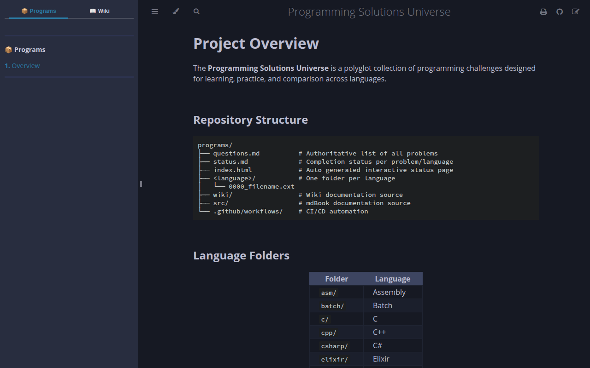
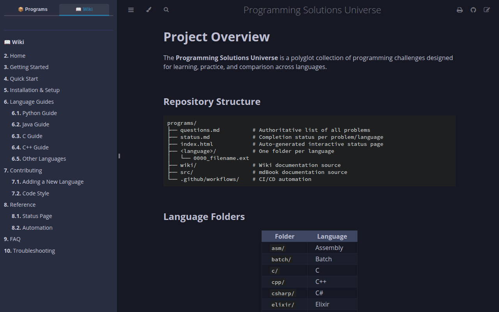
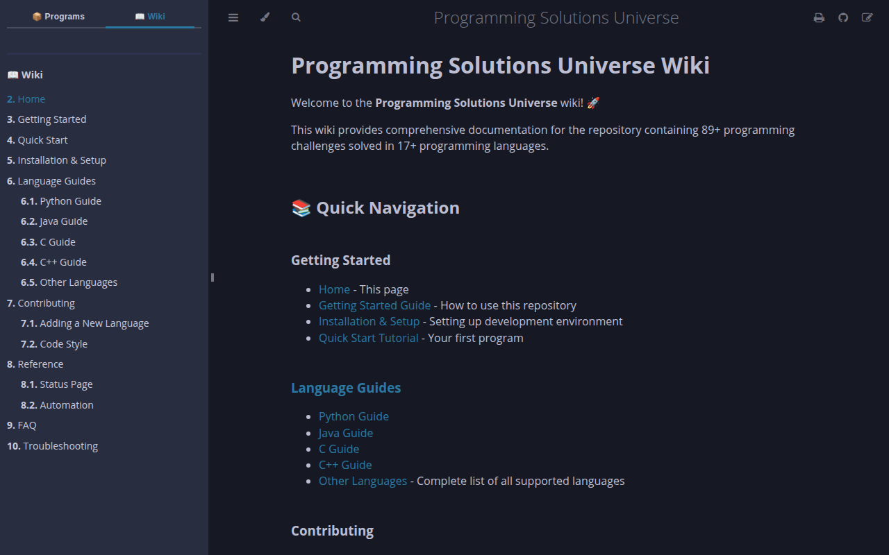

# Tab Screenshots

These screenshots demonstrate the working **Programs / Wiki tab UI** in the built mdBook site.

## 📦 Programs Tab (active)

Shows the **Programs** tab selected in the sidebar with the Project Overview page open.

## 📖 Wiki Tab (active, navigation visible)

Shows the **Wiki** tab selected — the full wiki table of contents appears in the sidebar with all 19 pages listed.

## 📖 Wiki — Home page

Shows the **Home.md** wiki page rendered inside mdBook. Content is served **unmodified** directly from the `wiki/` folder (copied at build time by the workflow).

Last updated: 2026-03-25 15:13:10 UTC
